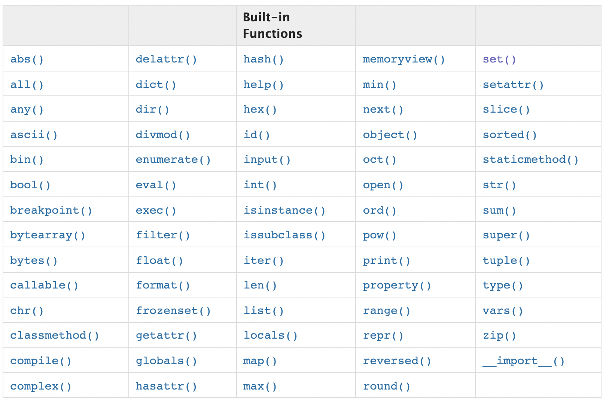

# PYTHON 03. Functions

> Check Point💡
>
> ​	✔️ How to define and call a function in Python
>
> ​	✔️ Arguments and parameters in a function


## 1. Built-in Functions

The Python interpreger has a number of functions built into it that are always availabe.



You can also check these functions like this:

```python
dir(__builtins__)
```

```
['ArithmeticError', 
 'AssertionError', 
 'AttributeError',
 'BaseException',
 'BlockingIOError',
 'BrokenPipeError',
 'BufferError',
 'BytesWarning',
 'ChildProcessError',
 'ConnectionAbortedError',
 'ConnectionError',
 'ConnectionRefusedError',
 'ConnectionResetError',
 'DeprecationWarning',
 'EOFError',
 'Ellipsis',
 'EnvironmentError',
 'Exception',
 'False',
 'FileExistsError',
 'FileNotFoundError',
 'FloatingPointError',
 'FutureWarning',
 'GeneratorExit',
 'IOError',
 'ImportError',
 'ImportWarning',
 'IndentationError',
 'IndexError',
 'InterruptedError',
 'IsADirectoryError',
 'KeyError',
 'KeyboardInterrupt',
 'LookupError',
 'MemoryError',
 'ModuleNotFoundError',
 'NameError',
 'None',
 'NotADirectoryError',
 'NotImplemented',
 'NotImplementedError',
 'OSError',
 'OverflowError',
 'PendingDeprecationWarning',
 'PermissionError',
 'ProcessLookupError',
 'RecursionError',
 'ReferenceError',
 'ResourceWarning',
 'RuntimeError',
 'RuntimeWarning',
 'StopAsyncIteration',
 'StopIteration',
 'SyntaxError',
 'SyntaxWarning',
 'SystemError',
 'SystemExit',
 'TabError',
 'TimeoutError',
 'True',
 'TypeError',
 'UnboundLocalError',
 'UnicodeDecodeError',
 'UnicodeEncodeError',
 'UnicodeError',
 'UnicodeTranslateError',
 'UnicodeWarning',
 'UserWarning',
 'ValueError',
 'Warning',
 'ZeroDivisionError',
 '__IPYTHON__',
 '__build_class__',
 '__debug__',
 '__doc__',
 '__import__',
 '__loader__',
 '__name__',
 '__package__',
 '__spec__',
 'abs',
 'all',
 'any',
 'ascii',
 'bin',
 'bool',
 'breakpoint',
 'bytearray',
 'bytes',
 'callable',
 'chr',
 'classmethod',
 'compile',
 'complex',
 'copyright',
 'credits',
 'delattr',
 'dict',
 'dir',
 'display',
 'divmod',
 'enumerate',
 'eval',
 'exec',
 'filter',
 'float',
 'format',
 'frozenset',
 'get_ipython',
 'getattr',
 'globals',
 'hasattr',
 'hash',
 'help',
 'hex',
 'id',
 'input',
 'int',
 'isinstance',
 'issubclass',
 'iter',
 'len',
 'license',
 'list',
 'locals',
 'map',
 'max',
 'memoryview',
 'min',
 'next',
 'object',
 'oct',
 'open',
 'ord',
 'pow',
 'print',
 'property',
 'range',
 'repr',
 'reversed',
 'round',
 'set',
 'setattr',
 'slice',
 'sorted',
 'staticmethod',
 'str',
 'sum',
 'super',
 'tuple',
 'type',
 'vars',
 'zip']
```


## 2. Find the middle character(s) of a given string

Write a Python program to find the middle character(s) of a given string. If the length of the string is odd return the middle character and return the middle two characters if the string length is even.

```python
def get_middle_char(word):
    mid1 = (len(word)+1)//2
    mid2 = (len(word)+2)//2
    return word[mid1-1:mid2]              
```

```python
>>> get_middle_char('python')
th
>>> get_middle_char('faker')
k
>>> get_middle_char('confidential')
de
>>> get_middle_char('youtube')
t
```


## 3. Keyword Argument & Positional Argument

- **Keyword Argument**: an argument preceded by an idetifier in a function call or passes as a value in a dictionary preceded by `**`. 
- **Positional Argument**: an argument that is not a keyword argument. Positional arguments can appear at the beginning of an argument list and be passed as elements of an iterable preceded by `*`. 

Here are some examples using keyword and positional arguments:

```python
def ssafy(name, location='Seoul'):
    print(f'{name} in {location}')
```

```python
>>> ssafy('Rosé')
Rosé in Seoul
```

```python
>>> ssafy(location= 'Busan', name= 'Rosé')
Rosé in Busan
```

```python
>>> ssafy('Rosé', location= 'Daejeon')
Rosé in Daejeon
```

Positional argument has to follow keyword argument. If not, it will make an error:

```python
>>> ssafy(name= 'Rosé', 'Kwangju')
File "/var/folders/d3/r3hpdk4d5zn58pvyxndjnhjw0000gn/T/ipykernel_1378/832566083.py", line 1
    ssafy(name= 'Rosé', 'Kwangju')
                                 ^
SyntaxError: positional argument follows keyword argument
```


## 4. Practices

```python
def my_func(a,b):
    c = a+b
    print(c)

result = my_func(3,7)
```

```python
>>> result
None
```

'my_function' returns nothing. It only prints 'c' .


## 5. Arbitrary Argument Lists

Write a mean function that can take an arbitrary number of values

```python
def my_avg(*args):
    return sum(args)/len(args)
```

```python
>>> my_avg(77, 83, 95, 80, 70)
81.0
```


